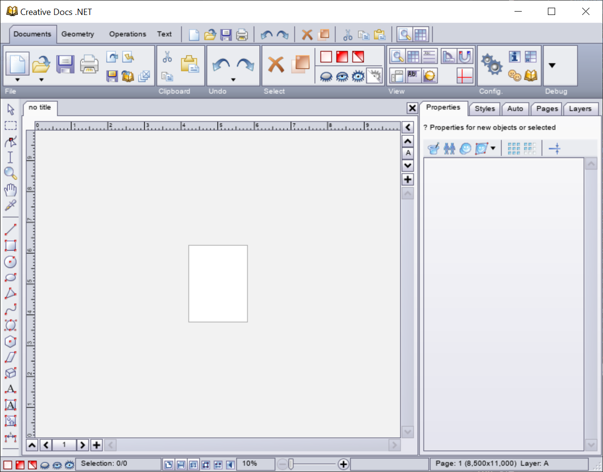

# Creative Docs .NET

## Overview

Creative Docs .NET is a vector graphics editor originaly developed at Epsitec SA between 2004 and 2014.
It supports creating images from simple vector shapes, adding text and bitmap images, multiple layers and pages and various export formats.

This open-source release is an attempt to modernise this software and port it to new platforms (macos and linux).

## Project status

This project is not in active development.

## Building

- clone this repository and it's submodules
- open `cresus-core/App.CreativeDocs` and build `App.CreativeDocs.sln` with Visual Studio or from the command line `dotnet build App.CreativeDocs.csproj`
- the other projects (`App.CresusDocuments` and `App.CresusPictogrammes`) can be built in a similar way

## Running

- run from Visual Studio or from the command line `dotnet run App.CreativeDocs.csproj`

## Contributing

If you are very motivated and want to build on this project, you might find the following documents usefull:

- [HISTORY_AND_FUTURE.md](HISTORY_AND_FUTURE.md) a summary of the history of Creative Docs .NET and a few guidelines on how to adapt it for the future
- [DESIGN.md](DESIGN.md) an overview of the main components that make Creative Docs .NET
- [TODO.md](TODO.md) a list of improvement ideas you could work on
- `lstodos.py` a python script to find todo comments and unimplemented methods in the Creative Docs .NET project

## Authors and acknowledgment

The original software was developed at Epsitec SA, mainly by Pierre Arnaud and Daniel Roux, between 2004 and 2014.
In 2024, an attempt to port the software for macOS and Linux was started by Baptiste Lambert with the help of Roger Vuistiner.

## License
This software is licensed under the GNU GPLv3.
See [LICENSE.txt](LICENSE.txt) for the full license text.